# Mask Evaluation Overview

This page summarizes mask-based evaluations using the images in `../images/masks/`.

The evaluations cover:

- student-defined annotations versus ground truth masks,
- student-defined annotations versus label masks,
- instance-level performance,
- union-of-student masks using 80% agreement,
- duplicate mask self-comparison.

**Ground Truth** are masks provided with original dataset. They do not provide object level division.
**Pseudo Ground Truth** used for instance level metrics are estimated using 2D StarDist script provided in original repo.

## Example Masks

These sample images show the input calibration masks and illustrate the annotation style used by students.

- `example_masks_16GRAY_045-cropped.png`
- `example_masks_1GRAY_030-cropped.png`
- `example_masks_4GRAY_000-cropped.png`
- `example_masks_9GRAY_015-cropped.png`

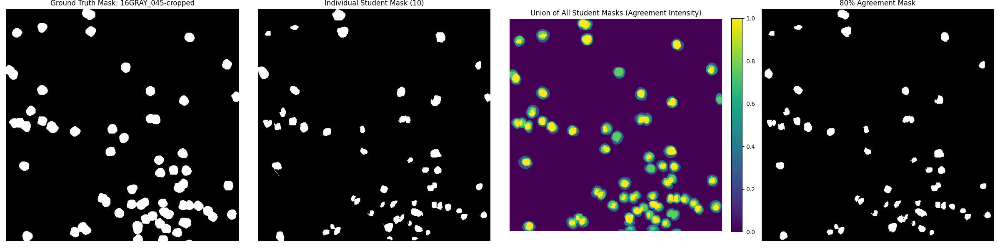
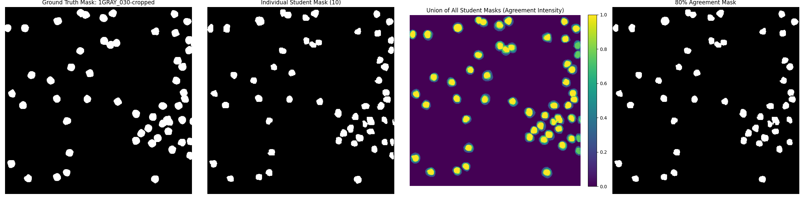
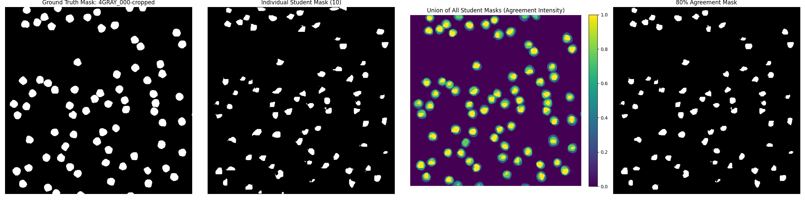
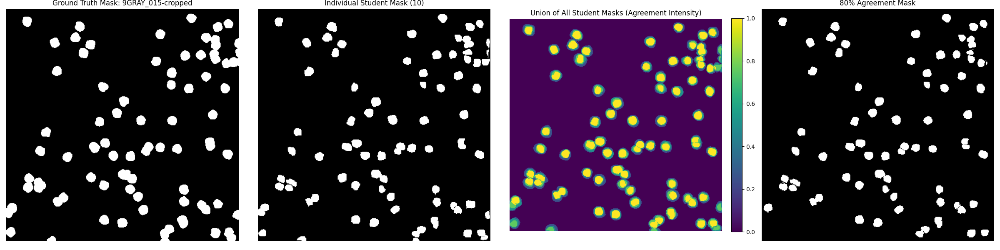

## Student Labels vs Ground Truth Masks

This evaluation compares the masks defined by students against the true segmentation masks. It measures how well students identified the correct objects and boundaries.

- `mask_comparison_metrics.png`: overall mask-level metrics such as IoU and F1 score.
- `individual_calibration_masks_vs_pseudo_gt-instance.png`: instance-level evaluation for individual calibration masks versus pseudo ground truth.
- `union_of_all_students_vs_gt.png`: union-of-all-student labels compared against ground truth.
- `80_percent_agreement_vs_gt.png`: the 80% agreement mask threshold compared to ground truth.

### Mask metric summary

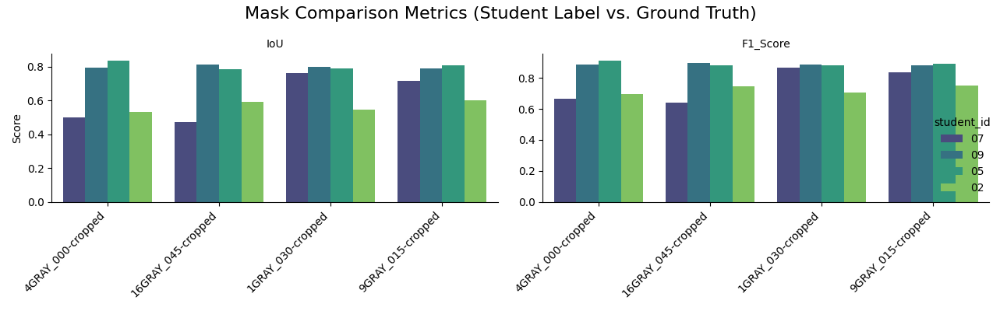

This plot shows the aggregate performance of student annotations against the ground truth. It reflects both consistency and correctness across the calibration set.

### Instance-level student calibration evaluation

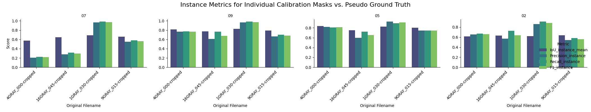

This instance-level view highlights how well individual student masks matched the pseudo ground truth on a per-object basis. Higher precision and recall here mean better instance matching, not just overlap.

### Union of all student masks vs ground truth

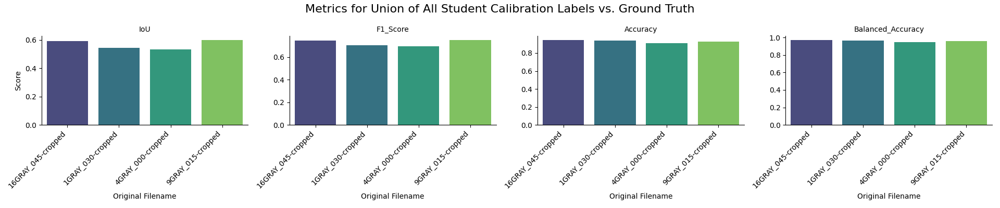

The union image aggregates all student annotations. Comparing this union to the ground truth reveals whether the group collectively captured the full object set, even if individual masks varied.

### 80% agreement mask vs ground truth

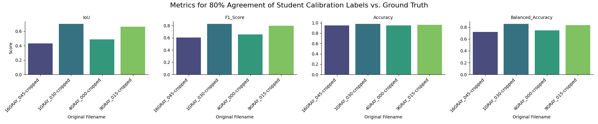

This image shows the mask built from pixels where at least 80% of students agreed. It indicates which regions are consistently annotated and which are uncertain.

## Calibration Images: Mask Results vs Ground Truth

The calibration images show a range of agreement levels when student masks are compared to ground truth.

- `1GRAY_030-cropped` and `9GRAY_015-cropped` have the highest average overlap, with mean IoU values near 0.73 and mean F1 scores above 0.83.
- `16GRAY_045-cropped` and `4GRAY_000-cropped` are lower-performing, with mean IoU values near 0.66 and mean F1 scores near 0.79.
- Reported accuracy is uniformly high (>95%), but this is expected because background dominates the images. Balanced accuracy is more informative here and ranges from about 0.89 to 0.94, showing that the foreground/background segmentation quality is more variable than raw accuracy suggests.

### Instance-level evaluation vs pseudo ground truth

Using pseudo ground truth derived from StarDist, instance-level metrics reveal object-level performance:

- **Student 09** shows the strongest instance matching, with average IoU_instance_mean of 0.804 across images, high precision (0.75) and recall (0.81), and F1_instance of 0.78. They excel on `1GRAY_030-cropped` (IoU 0.829) and `4GRAY_000-cropped` (IoU 0.819).
- **Student 05** is close behind with average IoU_instance_mean of 0.804, precision 0.77, recall 0.79, and F1_instance 0.78. Strong on `4GRAY_000-cropped` (IoU 0.837) and `9GRAY_015-cropped` (IoU 0.801).
- **Student 07** has moderate performance with average IoU_instance_mean of 0.642, but high precision on `1GRAY_030-cropped` (0.964) and `9GRAY_015-cropped` (0.549), though recall is lower on other images.
- **Student 02** has the lowest instance metrics, with average IoU_instance_mean of 0.626, precision 0.66, recall 0.72, and F1_instance 0.66. They struggle more on `1GRAY_030-cropped` (IoU 0.619) and `4GRAY_000-cropped` (IoU 0.616).

These instance metrics highlight that while overall mask overlap is reasonable, object-level correspondence varies. Students 09 and 05 are more consistent in detecting and matching individual objects, while 02 and 07 show more variability, possibly due to over- or under-segmentation.

### What the results imply

- Better-performing images such as `1GRAY_030-cropped` and `9GRAY_015-cropped` are likely easier to annotate consistently because object edges and contrast are clearer.
- Lower IoU on `16GRAY_045-cropped` and `4GRAY_000-cropped` suggests those images had more ambiguous foreground regions, touching objects, or uneven mask boundaries.
- The ground truth masks are not object-level, so these metrics reflect overall mask overlap rather than exact object correspondence. This means some errors may come from differences in object grouping rather than purely missing or extra cells.

### Probable problems in the student annotations

- Missing or incomplete masks for objects that were hard to distinguish from the background.
- Extra foreground regions where students over-segmented or marked noise as objects.
- Inconsistent handling of touching or overlapping objects, leading to undersegmentation or merged regions.
- Variation in boundary precision, especially for fainter or partially visible cells.
- Differences in mask density and fill; some annotations may be thinner or more fragmented than the ground truth.

### Student-specific observations

- Student `09` and student `05` appear to have the strongest overlap with ground truth, especially on `1GRAY_030-cropped`, `9GRAY_015-cropped`, and `4GRAY_000-cropped`.
- Student `02` shows notably lower overlap on `1GRAY_030-cropped` and `4GRAY_000-cropped`, suggesting either a different annotation strategy or more frequent false positives/false negatives in those images.

These calibration-image results support the broader mask evaluation: the overall annotation quality is reasonable, but individual images  vary enough that ground truth agreement is not uniformly high. Use the union and 80% agreement masks to identify the most reliable regions, and use per-image metrics to prioritize where annotation guidance or correction is most needed.

## Student-defined Labels vs Label Masks

This section shows how student annotations compare to the provided label masks. These comparisons are useful for understanding internal agreement and the quality of student-defined boundaries.

- `individual_duplicate_masks_vs_pseudo_gt-instance.png`: instance performance of duplicate student masks against pseudo ground truth.
- `individual_duplicate_masks_vs_gt.png`: individual duplicate masks compared directly to ground truth.
- `union_of_duplicate_masks_vs_gt.png`: union of duplicate student masks compared to ground truth.
- `duplicate_masks_self_comparison.png` and `duplicate_masks_self_comparison-instance.png`: self-consistency checks for duplicate masks.

### Individual duplicate masks vs ground truth

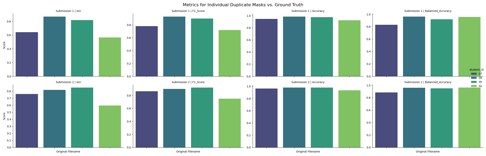

This comparison demonstrates how repeated annotations from the same student or duplicate mask sets align with the true mask. It reveals both label consistency and dataset-specific difficulty.

### Union of duplicate masks vs ground truth

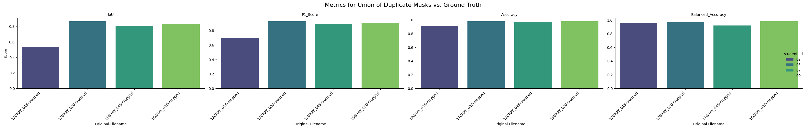

This shows whether combining duplicated student annotations improves overall coverage and whether duplicates help reduce false negatives.

### Duplicate mask self-comparison

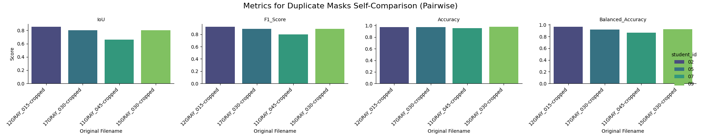

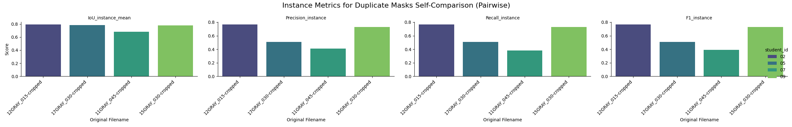

These plots measure how duplicate annotations compare to each other. They are useful for assessing intra-student reproducibility and the consistency of duplicate labeling.

Instance-level self-comparison metrics show reproducibility in object detection:

- **Student 02** on `12GRAY_015-cropped`: IoU_instance_mean 0.791, Precision 0.765, Recall 0.765, F1_instance 0.765. High symmetry indicates consistent duplicate annotations.
- **Student 05** on `17GRAY_030-cropped`: IoU_instance_mean 0.785, Precision 0.506, Recall 0.506, F1_instance 0.506. Lower values suggest variability in duplicate masks, possibly due to image difficulty.
- **Student 07** on `11GRAY_045-cropped`: IoU_instance_mean 0.683, Precision 0.407, Recall 0.379, F1_instance 0.393. Indicates moderate consistency but with some precision/recall imbalance.
- **Student 09** on `15GRAY_030-cropped`: IoU_instance_mean 0.778, Precision 0.729, Recall 0.729, F1_instance 0.729. Strong reproducibility, similar to Student 02.

Overall, Students 02 and 09 show better intra-student consistency in duplicate annotations, while 05 and 07 have more variation, which could reflect differences in annotation strategy or image complexity.

## Comments and Interpretation

- The ground truth comparisons show where student masks diverge from the true object set. High IoU and F1 scores in `mask_comparison_metrics.png` indicate good overall alignment, while lower scores highlight segmentation errors or omitted objects.
- Instance-level plots reveal whether errors are due to missing objects (`recall` issues) or incorrect extra objects (`precision` issues).
- The union-of-all-students mask is useful for evaluating collective coverage. If this union is close to the ground truth, it suggests that students together capture most objects even if individual masks vary.
- The 80% agreement mask identifies reliably annotated regions. Areas excluded from this mask are where student agreement is weak, signaling ambiguous or difficult boundaries.
- Duplicate mask evaluations assess reproducibility. If duplicate masks show high self-comparison scores, the annotation process is consistent; low scores suggest that the same student or workflow produced variable results.

Together, these views provide a layered assessment of mask quality: from individual label correctness to group agreement and reproducibility. Use the images to identify whether errors are primarily in object detection, boundary accuracy, or annotation consistency.