# Evaluation Chart Overview

This page embeds the evaluation charts stored in `../images/counts/`.

The chart images compare the following methods:

- `manual_count`: Points clicked manually in ImageJ/Fiji.
- `script_own`: Results from your custom-tuned Fiji macro.
- `script_simple`: Results from basic global thresholding (Class Workshop).
- `script_watershed`: Results from classic Watershed segmentation (Class Workshop).
- `script_own_sparse`: WEKA segmentation based on custom sparse training.
- `script_StarDist`: Results using the pre-trained StarDist model available in the plugin.

## Comparison Charts

### Manual Count
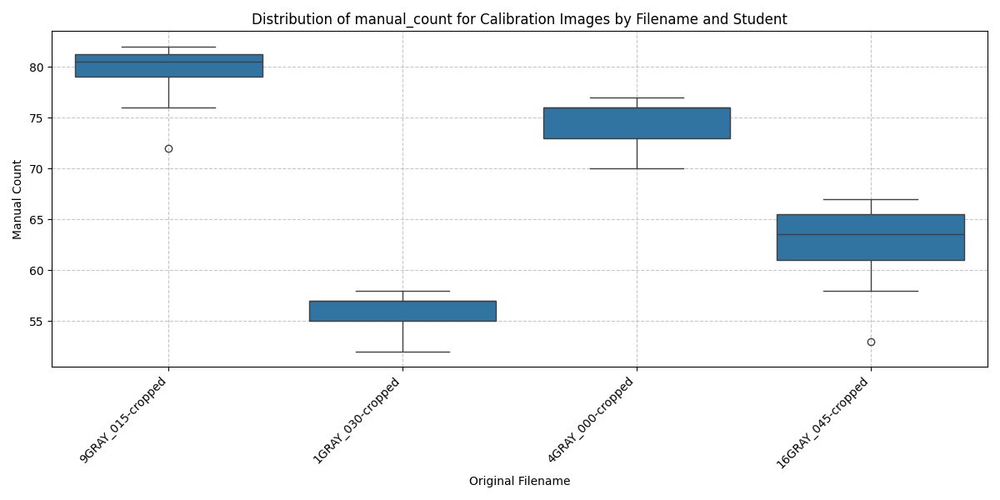
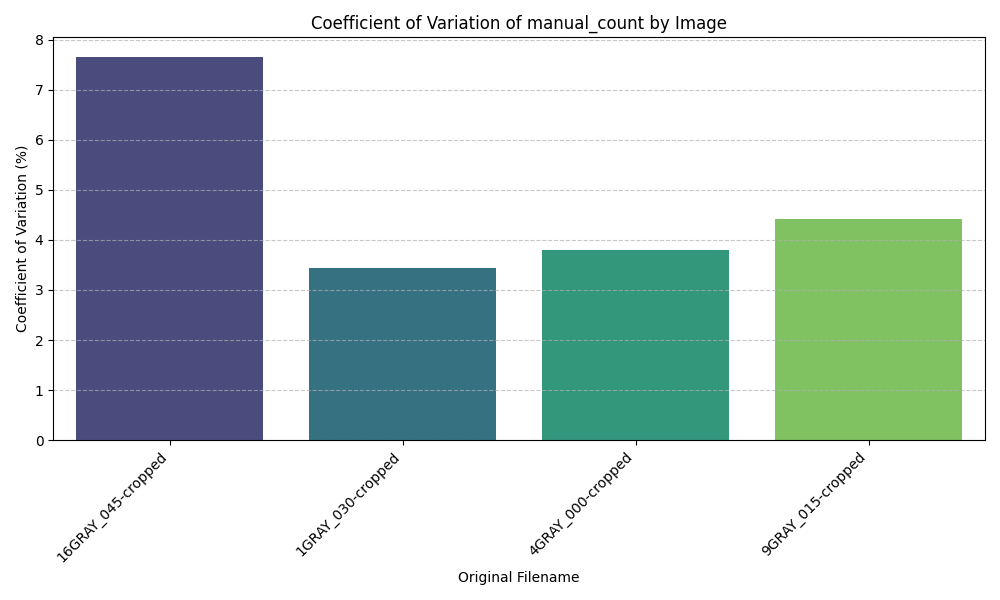

### Custom Macro (`script_own`)

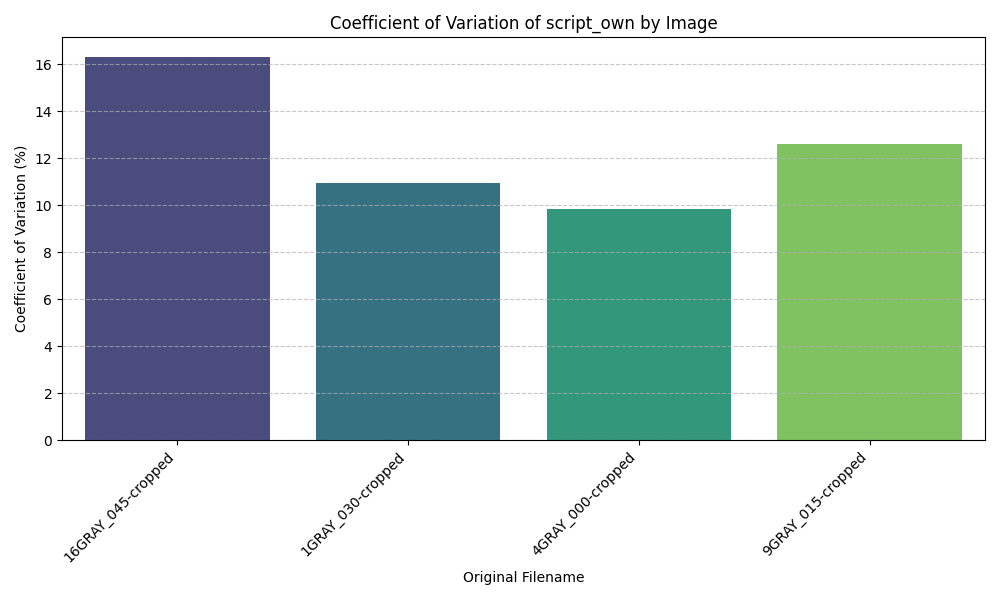
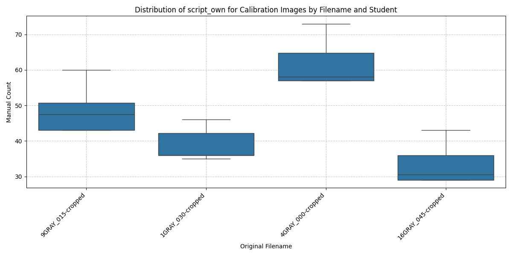

### Basic Global Thresholding (`script_simple`)

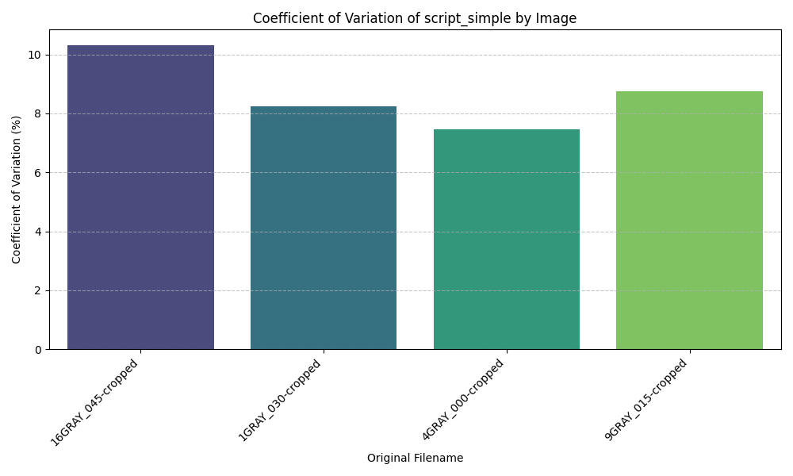
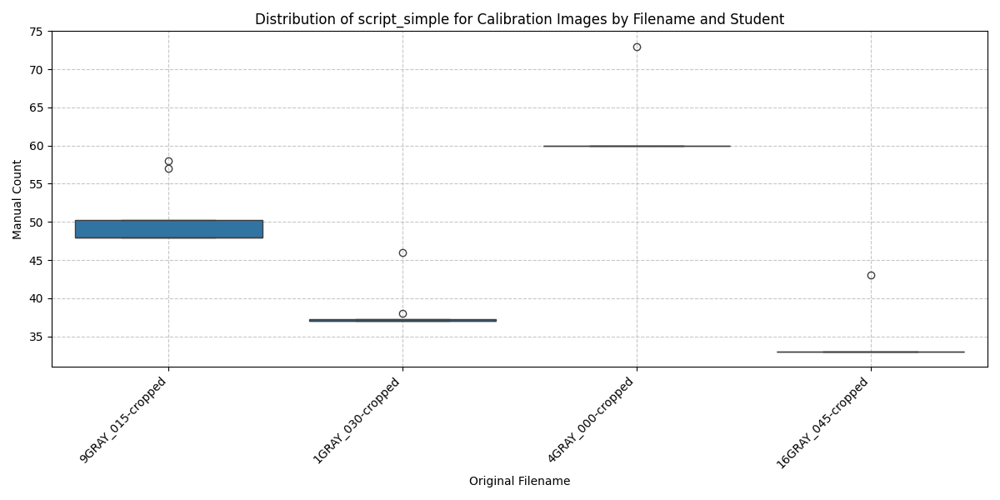

### Watershed Segmentation (`script_watershed`)

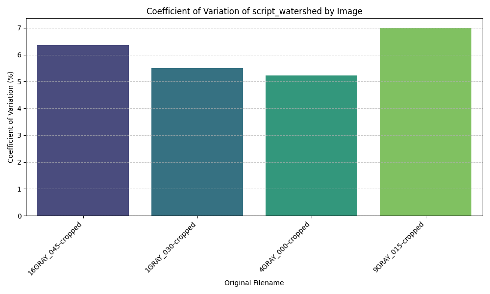
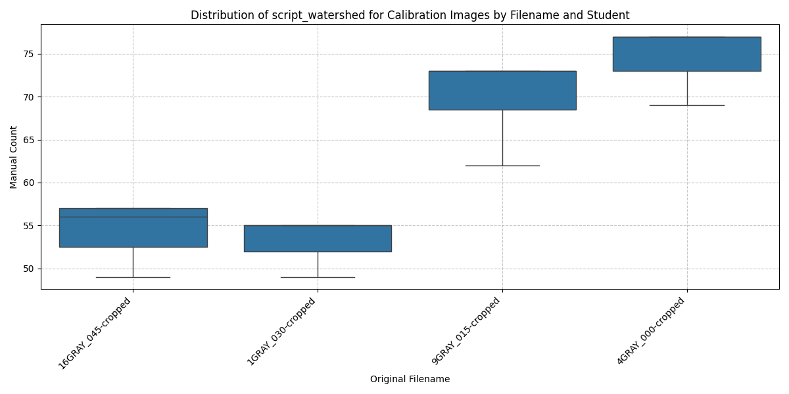

### Sparse WEKA Segmentation (`script_own_sparse`)

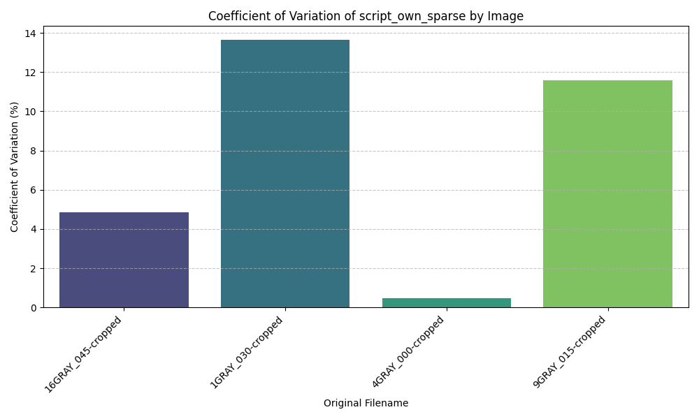
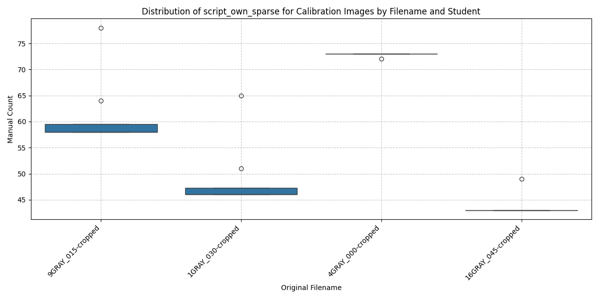

### StarDist Model (`script_StarDist`)

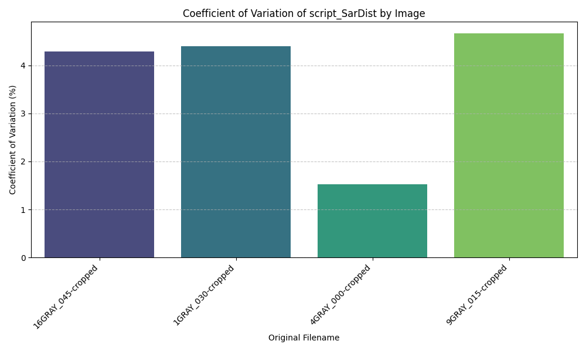
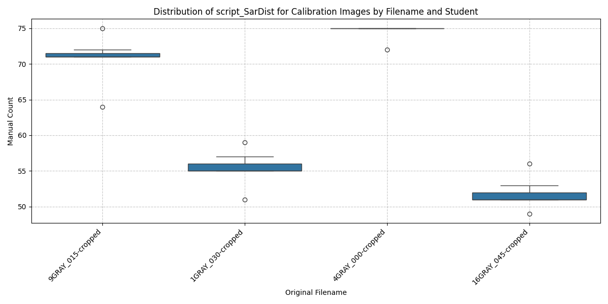

## Consistency and Coefficient of Variation

Coefficient of variation (CV) is the ratio of the standard deviation to the mean count, expressed as a percentage. Lower CV values indicate more consistent results across repeated measurements for the same image.

### CV Values by Method and Image

| Method | 16GRAY_045-cropped | 1GRAY_030-cropped | 4GRAY_000-cropped | 9GRAY_015-cropped | Average CV (%) |
|---|---|---|---|---|---|
| `manual_count` | 7.66 | 3.44 | 3.80 | 4.41 | 4.83 |
| `script_own` | 16.33 | 10.93 | 9.85 | 12.60 | 12.42 |
| `script_simple` | 10.32 | 8.24 | 7.46 | 8.75 | 8.19 |
| `script_watershed` | 6.35 | 5.49 | 5.22 | 7.01 | 6.02 |
| `script_own_sparse` | 4.85 | 13.67 | 0.49 | 11.57 | 7.15 |
| `script_StarDist` | 4.28 | 4.40 | 1.52 | 4.67 | 3.72 |

### Interpretation

- `script_StarDist` is the most consistent overall, with the lowest average CV (about 3.7%) and low CV values for every image.
- `manual_count` is also quite consistent, especially for the calibration images, but it still shows more variation than `script_StarDist`.
- `script_watershed` performs moderately well, with average CV around 6.0%, making it the next most consistent automatic method.
- `script_simple` and `script_own_sparse` have larger variation, and `script_own_sparse` is particularly inconsistent across images despite one very low-CV case.
- `script_own` is the least consistent, with the highest CV values across all images and an average CV above 12%.

### Conclusion

For consistency in repeated count results, `script_StarDist` is the strongest choice. `manual_count` remains stable, but the automated StarDist approach is the most reliable across the calibration images in this set.

## Baseline Reproducibility and `script_simple`

The `script_simple` method was prepared centrally and distributed to every student as the standard calibration workflow. Students only needed to apply this script to their calibration images and report the resulting counts and CV values.

Because the script was already defined, the main sources of error are not algorithm design but execution and reporting:

- Students may have applied the script to the wrong image files or to images with different cropping or preprocessing than expected.
- The script may still require a correct Fiji/ImageJ environment and version; inconsistent plugin or macro execution across machines can change outcomes.
- Reported results may have been transcribed incorrectly from the software output into the submission table.
- Some users may have changed or extended the script accidentally when adapting it, which would invalidate the assumption of a common baseline.

The CV values suggest that `script_simple` did not behave as the most consistent baseline. That means the failure was likely in the process rather than the concept: the distributed script should have provided a reproducible benchmark, but the human workflow introduced variability.

This is important because it shows two different failure modes:

1. A reproducible method can still produce inconsistent submitted results if users do not apply it uniformly.
2. A baseline that is intended to be simple and robust still needs clear instructions, version control, and a check that everyone actually used the same script.

Therefore, while `script_simple` was the method that everyone should have applied, the observed inconsistency points to execution or reporting mistakes rather than a fundamental problem with the baseline algorithm itself.